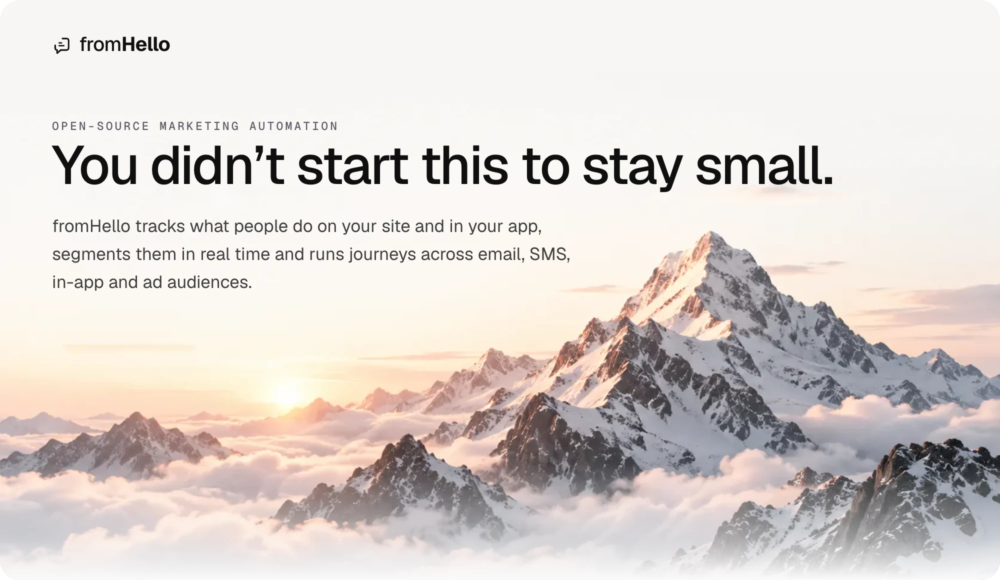
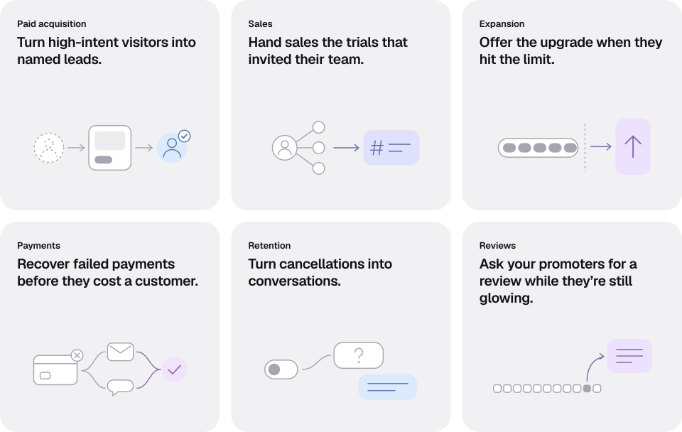
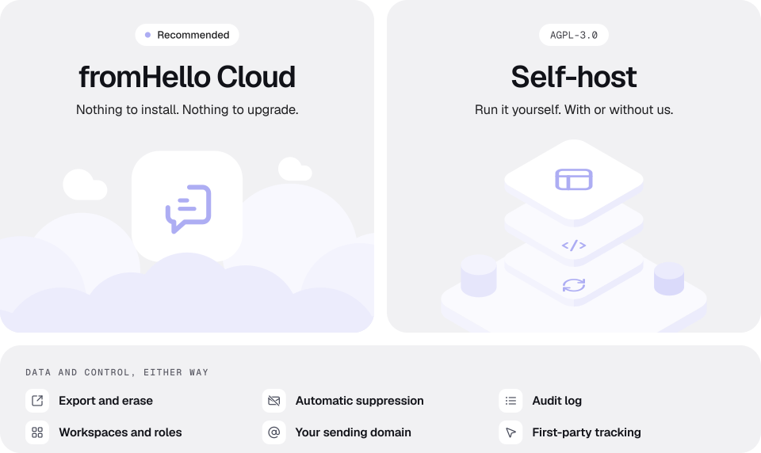

 
 

<a href="https://fromhello.io/?utm_source=github&utm_medium=readme#waitlist"><picture><source media="(prefers-color-scheme: dark)" srcset="https://raw.githubusercontent.com/Synapsr/fromHello/main/assets/btn-waitlist-dark.svg"></picture></a>
&nbsp;&nbsp;&nbsp;&nbsp;
<a href="https://github.com/Synapsr/fromHello"><picture><source media="(prefers-color-scheme: dark)" srcset="https://raw.githubusercontent.com/Synapsr/fromHello/main/assets/star-link-dark.svg"></picture></a>

 
 

<a href="LICENSE"><picture><source media="(prefers-color-scheme: dark)" srcset="https://raw.githubusercontent.com/Synapsr/fromHello/main/assets/badge-license-dark.svg"></picture></a>
<a href="#your-ai-plugged-in"><picture><source media="(prefers-color-scheme: dark)" srcset="https://raw.githubusercontent.com/Synapsr/fromHello/main/assets/badge-mcp-dark.svg"></picture></a>
<a href="https://fromhello.io/?utm_source=github&utm_medium=readme#waitlist"><picture><source media="(prefers-color-scheme: dark)" srcset="https://raw.githubusercontent.com/Synapsr/fromHello/main/assets/badge-waitlist-dark.svg"></picture></a>

 
 

<a href="#then-act-on-what-each-person-does">Product</a> &nbsp;·&nbsp;
<a href="#your-ai-plugged-in">AI and MCP</a> &nbsp;·&nbsp;
<a href="#how-it-all-comes-together">Use cases</a> &nbsp;·&nbsp;
<a href="#hosted-by-us-or-on-your-servers">Hosting</a> &nbsp;·&nbsp;
<a href="#good-to-know">FAQ</a>

 

> [!NOTE]
> This is fromHello’s public repository. The platform source isn’t published here yet. [Join the waitlist](https://fromhello.io/?utm_source=github&utm_medium=readme#waitlist) for early access to fromHello Cloud, and star the repo to help more teams find it.

## What is fromHello

fromHello is open-source marketing automation: first-party tracking, real-time segments and journeys triggered by what people do on your site and in your product, with email, SMS, in-app, web push and ad audiences in one platform. Use it on fromHello Cloud, or self-host it under AGPL-3.0.

## From anonymous visitor to paying customer.

fromHello covers every step in between.

- **Every visit counts, even before signup.** Site and app events land on one profile. At signup, the anonymous history joins the contact.
- **Spot who’s ready to buy.** Real-time segments update on every event.
- **Visitors who left come back.** Web push and ad audiences, before signup.
- **Trials don’t go quiet.** Journeys start on events: email, in-app, SMS.
- **See what converts.** Goals and funnels, from first visit to paid.

## Connect everything in one place.

What you know about each person, all in one profile.

## Then act on what each person does.

Segment them, run journeys, read replies, track goals.

<b>Journeys.</b> Journeys that wait for people, not dates.

- Wait for event: one path when it happens, another on timeout.
- Branch on a profile field, an event or a segment. First match wins.
- 14 node types, including A/B split, webhook and goal.

<b>Segments.</b> Who opened, who clicked, who never replied.

- Filter by event, profile field, message status or suppression.
- Event rules: at least N times, over all time or a rolling window.
- Nest AND/OR groups and watch the match count as you edit.

<b>Channels & inbox.</b> The message goes out. The reply shows up on their profile.

- Email through Resend, Postmark, SendGrid, SMTP or Microsoft 365.
- SMS, in-app banners and modals, opt-in web push and ad audiences.
- A reply can start a journey, or wake one that’s waiting for it.

<b>Results.</b> Judge each journey by its goals.

- Entered, completed and failed per journey, over 7, 14, 30 or 90 days.
- A goal funnel: how many reached each one.
- A/B splits call a winner only with enough data and a significant lift.

## Your AI, plugged in.

Use the AI subscription you already have to ideate, build, track, analyze and improve. 59 tools, one MCP server.

Works with Claude, Claude Code, Cursor, Codex or any MCP client. No AI tool in fromHello sends a message, and a journey your agents build stays a draft until it’s published. MCP calls are never metered. No AI subscription? From Team up, cloud plans include AI credits for the built-in assistant.

## How it all comes together.

Six plays to grow your business.

## Hosted by us, or on your servers.

Two ways to run fromHello.

- **fromHello Cloud.** We run Postgres, Redis and every upgrade. From Team up, email sending is set up for you and AI credits are included. [Join the waitlist](https://fromhello.io/?utm_source=github&utm_medium=readme#waitlist)
- **Self-host.** The source isn’t published here yet. Self-hosted, fromHello runs on your own servers: Postgres 18+, Redis 8+, an API, a worker, the dashboard and an optional MCP server. You run upgrades and backups, with your own sending provider and AI key, or local models through Ollama.

<b>Data and control, either way</b>

- **Export and erase.** Export a contact as JSON, or erase their profile and messages, through the API. Every erasure is audit-logged.
- **Automatic suppression.** Unsubscribes and bounces feed a suppression list, checked before every send.
- **Audit log.** Invites, API keys, sending settings, consent changes, erasures and MCP tool calls.
- **Workspaces and roles.** Separate workspaces, four roles from owner to viewer, and API keys scoped to one workspace.
- **Your sending domain.** Email goes out from your own domain, so its reputation is yours.
- **First-party tracking.** Our tracking loads no third-party pixels.

## Good to know.

The code, self-hosting, following along, the AI, your data, the stack and the price.

<b>Where’s the source code?</b>

 

The platform source isn’t published here yet. This repository holds the README, the AGPL-3.0 license, project files and images: there’s no code here to clone, build or run, and no codebase to report bugs against or send pull requests to. A contribution guide covering setup, architecture and conventions will land with the source. To report a security issue, follow [SECURITY.md](SECURITY.md), never a public issue.

<b>Can I self-host fromHello today?</b>

 

No. The source isn’t published here yet, and self-hosting needs it. Self-hosting is part of fromHello, under AGPL-3.0, and a self-hosting guide will land with the source. Beyond what [the hosting section](#hosted-by-us-or-on-your-servers) lists, a self-hosted install needs two domains with TLS: one for the dashboard and one for the API. The API must be reachable from the internet for provider webhooks, the tracking snippet and unsubscribe links.

<b>How do I follow along?</b>

 

A star saves this repository to your Stars list and helps more teams find fromHello, but GitHub sends no notifications for it. For early access to fromHello Cloud, [join the waitlist](https://fromhello.io/?utm_source=github&utm_medium=readme#waitlist): it opens in stages, and we email you when your spot opens.

<b>What can AI change without my approval?</b>

 

No AI tool in fromHello sends a message, but AI actions can change live journeys without a confirmation step. Publishing, pausing or deleting through an agent takes a second, confirming tool call, which your AI client can ask you to approve. Other edits, such as changes to a segment, a template or a live journey’s exit condition, apply when saved. Opt-in send-time personalization rewrites each email without per-message review. If the AI fails, the send waits by default.

<b>Does fromHello work without AI?</b>

 

Yes. Tracking, segments, journeys and sending work with no AI set up. To add AI, connect the AI client you already use over MCP: it brings its own model, so fromHello needs no AI key for it. Self-hosted, fromHello’s own AI features take your key for Anthropic, OpenAI or Google, or run on local models through Ollama.

<b>Where is my data stored?</b>

 

On fromHello Cloud, your data sits in the Postgres we run. Self-hosted, it sits in your own Postgres, and the tracking snippet is served by your own API and sends events to it. With your own SMTP server and local models through Ollama, your data can stay entirely on your servers. Otherwise, the services you connect receive what they need: your email and SMS providers, a hosted AI model and ad platforms.

<b>What is fromHello built with?</b>

 

TypeScript on Node.js, in one pnpm and Turborepo workspace: a Next.js dashboard, a Hono API, a BullMQ worker on Redis, Postgres through Drizzle ORM and an MCP server built on the official MCP TypeScript SDK, over stdio or HTTP. Authentication is Better Auth, and templates use LiquidJS.

<b>What does fromHello cost?</b>

 

fromHello Cloud is priced by the contacts you can reach. Seats and events never add to it, and deleted, anonymous and suppressed contacts never count. Self-hosting is AGPL-3.0, on servers and providers you run and pay for.

 

 

<a href="https://github.com/Synapsr/fromHello"><picture><source media="(prefers-color-scheme: dark)" srcset="https://raw.githubusercontent.com/Synapsr/fromHello/main/assets/btn-star-dark.svg"></picture></a>

A star helps more teams find fromHello.

 
 
 

<a href="https://fromhello.io/?utm_source=github&utm_medium=readme"><picture><source media="(prefers-color-scheme: dark)" srcset="https://raw.githubusercontent.com/Synapsr/fromHello/main/assets/wordmark-dark.svg"></picture></a>

 
 

fromHello is built by [Synapsr](https://synapsr.io), the studio behind [Pelli](https://pelli.io) and [Louez](https://louez.io).

[Website](https://fromhello.io/?utm_source=github&utm_medium=readme)

AGPL-3.0

